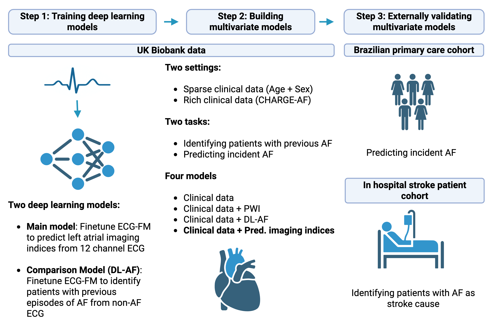

## Diagnosing atrial cardiomyopathy from 12 lead ECG with deep learning


This github contains the code to the paper: **Diagnosing atrial cardiomyopathy from 12 lead ECG using deep learning (under review).** In this paper we finetune a ECG foundational model (ECG-FM) published by McKeen et al. to predict cardiac imaging markers of atrial cardiomyopathy. We call this model AtCM_CMR. We then show that the predicted imaging markers allow the prediction of atrial fibrillation, outperforming previous approaches. 

We compare against two baselines. One baseline is created by extracting P wave indices (PWI) from the ECGs. The PWI can be extracted using the Jupyter Notebook in the folder P wave indices.

The second baseline is created by finetuning ECG-FM to identify patients with previous diagnosis of atrial fibrillation directly. We call this model DL_AF

## Contents:
- [Installation](#installation)
- [Data](#data)
- [Preprocessing](#preprocessing)
- [Model finetuning](#model-finetuning)
- [Inference](#inference)
- [Getting P wave indices](#getting-p-wave-indices)
- [Saliency_analysis](#saliency_analysis)
- [About ECG-FM](#about-ecg-fm)
- [Citing this work](#citing-this-work)
- [Questions](#questions)


## Installation

First clone this repository. We recommend creating a conda environment using the provided environment.yml file
ECG-FM was built in collaboration with fairseq-signals, relevant dependencies are all installed via the environment.yml file. We worked with python version 3.10.6.

````console
git clone https://github.com/jul-des/DL-AtCM
cd DL-AtCM
conda env create -f environment.yml -n dl_atcm
conda activate dl_atcm
````

Next, download the ECG-FM pretrained model from https://huggingface.co/wanglab/ecg-fm/tree/main. We finetune the mimic_iv_ecg_physionet_pretrained.pt model. Details on ECG-FM can be found below.

Our finetuned models will be made available via the UK Biobank, according to UK Biobank regulations. More details will be added in the near future

## Data

For model finetuning we used data from the UK Biobank. The UK Biobank will make its data available to all researchers for all types of health-related research that is in the public interest. For details on the access preocedure see the UK Biobank website: http://www.ukbiobank.ac.uk/register-apply/.

We evaluate our model on a primary care cohort from Brazil (CODE-15% dataset). This dataset is publicly available under: https://zenodo.org/records/4916206

## Preprocessing

We preprocess and segment the ECGs according to the specifications of McKeen et al. Their pipeline contains resampling to 500 Hz, normalization of ECGs and segmentation into 5 second segments. ECG-FM was built in collaboration with fairseq-signals, where the preprocessing pipeline is implemented. Details can be found under https://github.com/Jwoo5/fairseq-signals/tree/master/scripts/preprocess/ecg. For preprocessing of the CODE15% Dataset a solution is already implemented. For other datasets the example_records.py and example_signals.py scripts will have to be adapted according to the specifications.

Our deep learning models expect ECGs of shape  (N, 12, 2500) as input i.e. 12-channel, 5 second ECGs resampled to 500 Hz. The leads should be in the order: 'I', 'II', 'III', 'aVR', 'aVL', 'aVF', 'V1', 'V2', 'V3', 'V4', 'V5', 'V6'. Missing leads can be masked with zeroes. For PWI extraction any ECG length can be handled, although results become more reliable the more P waves are present in the ECG signal.

## Model Finetuning

We have built two different models, both by finetuning ECG-FM. We finetune one model (AtCM_CMR) to predict cardiac magnetic resonance imaging features of atrial cardiopathy from 12 lead ECG. We finetune a second model (DL_AF) to identify patients with previous diagnosis of atrial fibrillation directly.

The models and helper functions are defined in ModelClassAtCM_CMR.py and ModelClassDL_AF respectively. The hyperparameters are defined in config.yaml and the finetuning is performed in model_finetuning_AtCM_cmr.py and model_finetuning_dl_af.py respectively. 

To run the scripts for training, the paths at the top of the files have to be defined.  

## Inference

In the directory Model Evaluation, the provided Jupyter Notebooks can be run to get model predictions.

## Getting P wave indices

The Jupyter Notebook in the directory P wave indiced can be run to get P wave indices (P wave durtation, PQ intervall, P Axis and P amplitude in lead II) of ECGs. We ran the code on the preprocessed but not segmented 12 lead ECGs, returned by the described preprocessing pipeline.

## Saliency analysis 
The Jupyter Notebook in the directory Saliency can be run to get saliency maps for 12 lead ECGs

## About ECG-FM
ECG-FM was pretrained using self-supervised learning on over 1 million ECG samples and can be finetuned for a wide array of finetuDetails concerning ECG-FM can be found under:

```
"McKeen K, Masood S, Toma A, Rubin B, Wang B. ECG-FM: an open electrocardiogram foundation model. Jamia Open. 
1. Oktober 2025;8(5):ooaf122."
```
Be sure to also checkout the corresponding github repository under: https://github.com/bowang-lab/ecg-fm

## Citing this work
When using this work please cite: 

```
Diagnosing atrial cardiomyopathy from 12 lead ECG with deep learning. (Under review)
Julian Deseoe, Ezequiel de la Rosa, Martin Haensel, Lisa Herzog, Andreas R. Luft, 
Beate Sick, Jan Steffel, Alexander Breitenstein, Gregory Y.H. Lip, Bjoern Menze, Susanne Wegener.
```
Please also cite:
```
McKeen K, Masood S, Toma A, Rubin B, Wang B. ECG-FM: an open electrocardiogram foundation model. Jamia Open. 
1. Oktober 2025;8(5):ooaf122.
```
as our work builds on their ECG-FM model.

## Questions
Inquiries can be directed to julian.deseoe@uzh.ch
